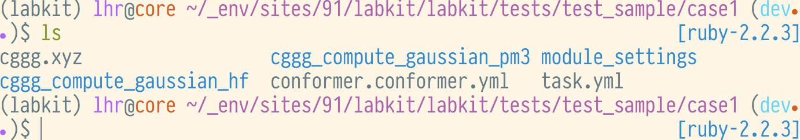
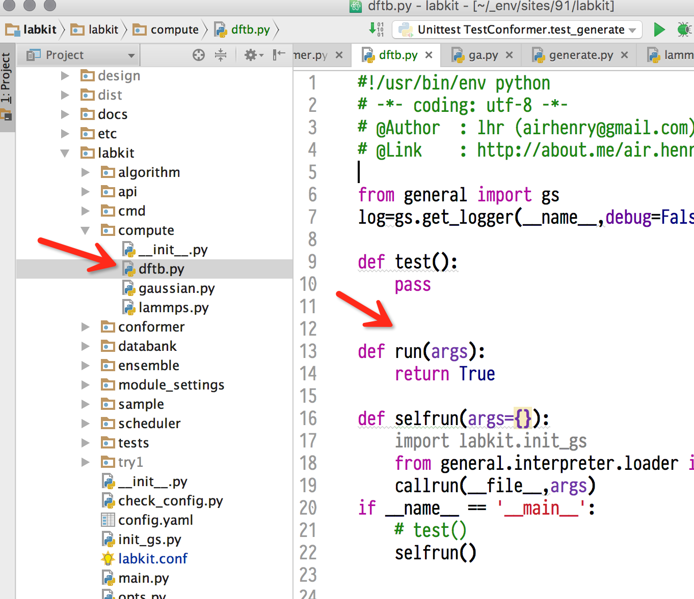
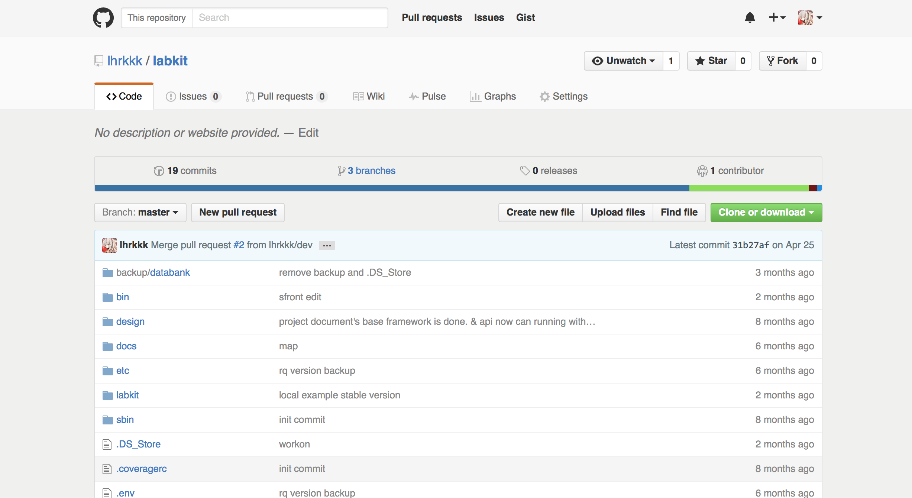
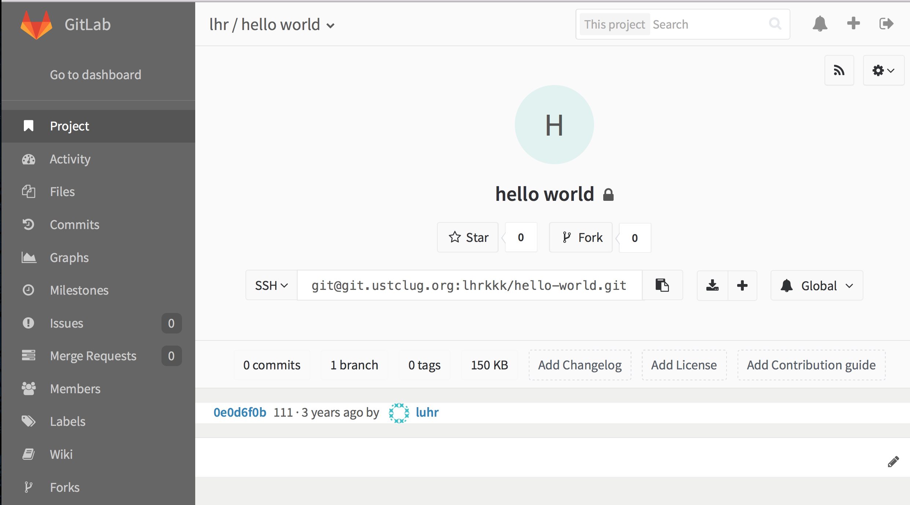
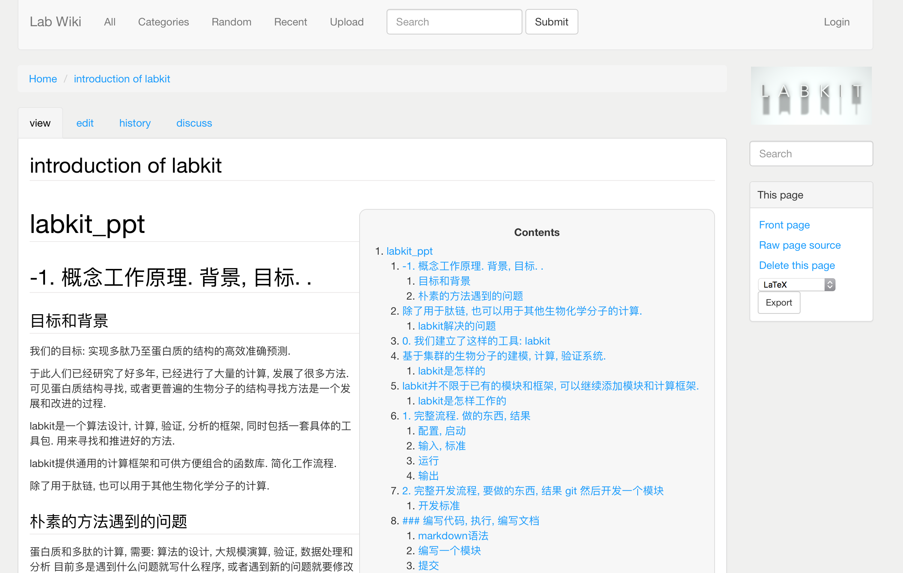
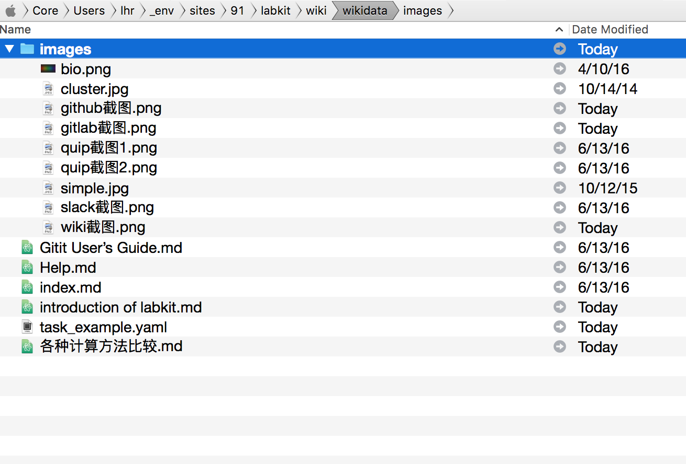
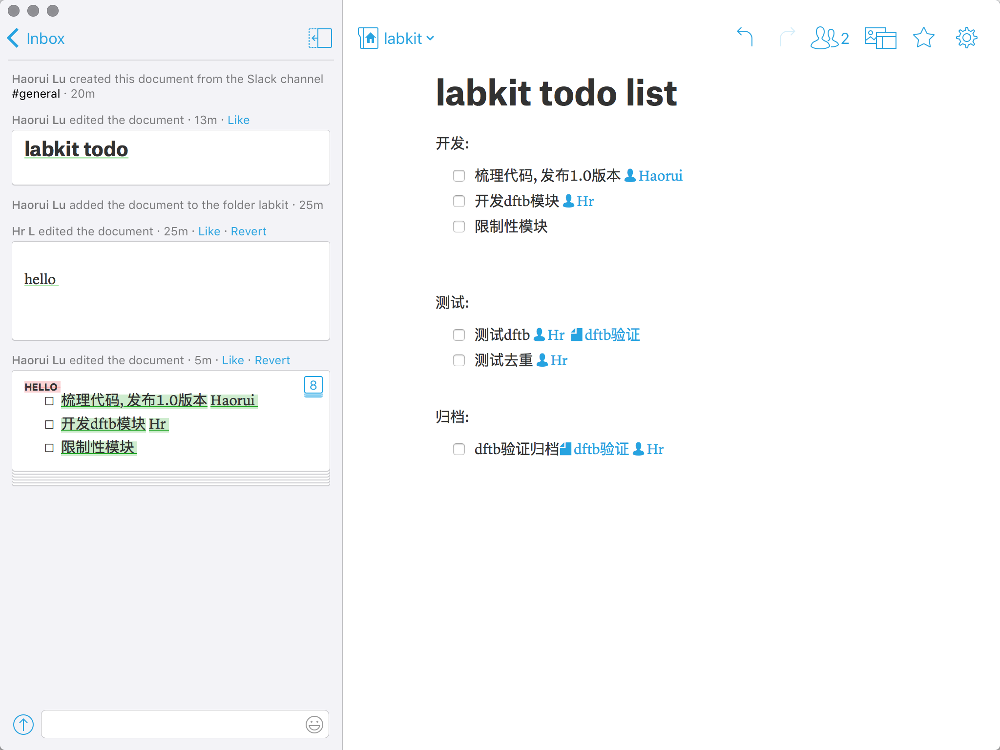

labkit\_ppt
===========

-1. 概念工作原理. 背景, 目标. .
-------------------------------

### 目标和背景

我们的目标: 实现多肽乃至蛋白质的结构的高效准确预测.

于此人们已经研究了好多年, 已经进行了大量的计算, 发展了很多方法.
可见蛋白质结构寻找, 或者更普遍的生物分子的结构寻找方法是一个发展和改进的过程.

labkit是一个算法设计, 计算, 验证, 分析的框架, 同时包括一套具体的工具包. 用来寻找和推进好的方法.


### 朴素的方法遇到的问题

蛋白质和多肽的计算, 需要:
算法的设计, 大规模演算, 验证, 数据处理和分析
目前多是遇到什么问题就写什么程序, 或者遇到新的问题就要修改程序, 程序之间标准也不统一. 重用性不好. 每个人写的程序只能自己看懂和改进, 其他人最多只能使用编译好的版本, 而且一旦情况有变, 或者出现bug, 就无能为力. 无法可持续发展.

labkit提供通用的计算框架和可供方便组合的函数库. 简化工作流程.

除了用于肽链, 也可以用于其他生物化学分子的计算.


----

### labkit解决的问题

算法设计, 计算, 合作, 知识保留

约定架构, 组件正交, 统一
标准化接口, 不轻易更改, 便于模块化编程.
规范化文档, 便于记录, 维护和后来者

最终目标: 只需要给出需求, 就可以得到结果
设计: 把设计写下来就是设计稿. 可以保存.
有了设计稿, 就可以直接进行计算.
有了计算结果, 就可以直接进行已有的分析.

----

0. 我们建立了这样的工具: labkit
-------------------------------
基于集群的生物分子的建模, 计算, 验证系统.
-----------------------------------------


----

### labkit是怎样的

labkit是一个有约定标准的python编程框架. 使用约定优于配置, 基于文件和目录的组织形式.

labkit是一系列层级分明的模块的集合, 你可以用任意方式使用它们.

labkit有一个vector向量模型计算框架, 并且是目前主要计算框架.

labkit并不限于已有的模块和框架, 可以继续添加模块和计算框架.
----

### labkit是怎样工作的

----

#### 层级化
1. 语言, 语句库
1. 语言的组合->函数, 函数库
1. 函数的组合->模块, 模块库
1. 模块的组合->算法, 算法库

语言->语句库
(语句库里的)语言的组合->函数, 函数堆积->函数库
(函数库里的)函数的组合->模块, 模块堆积->模块库
(模块库里的)模块的组合->算法, 算法堆积->算法库

----

#### 模块化
labkit是一个模块组合框架, 包含多肽算需要的功能模块和并行化框架.

每一个模块可以由很多函数或文件组成.

```
.
├── algorithm   算法
├── api					对外接口
├── cmd					命令行接口
├── compute			单体计算, 高斯等
├── config.yaml
├── conformer		构型操作
├── databank		数据仓库操作
├── ensemble		集合操作
├── labkit.conf
├── module_settings  模块默认配置
├── sample		
├── scheduler		调度器
├── tests				测试代码
```

在并行框架下有如下功能模块

```
- 构型操作
  - 构型修改
  - 构型拼接
- 采样操作  
  - 构成产生
  - 基因算法
- 计算操作
  - 高斯
  - 力场
```

----

#### vector
^ 总体原则知道了后面就好实现了, 为什么是向量, 因为要并行, 向量里面每一个元素可以被并行.

labkit的并行是向量为基础的

```
[1 2 3 4]
    ↓  x^2
[1 4 9 16]
    ↓  x<5
  [1 4]
    ↓  sum
    5
```
向量每一个元素可以分发到一个worker上执行. worker不限机器, 不限系统.


----


^ 我们知道有一些计算是必须顺序执行不能并行的, 后一步计算依赖上一步计算的结果的计算都是不能并行的.
串行的过程怎么办. 只需要写在并行之间的模块里面就行了. 或者写在只有一个元素的向量里面就行了. 向量可以转化为标量, 对不对.


1. 向量元素之间的关系必须平行
2. 不能并行的过程, 写在模块里面. 或者用只有一个元素的向量.

----

向量化之后的流程结构, 用yaml的格式描述. labkit讲根据描述进行计算.

#### 合作开发
使用git版本控制系统合作开发程序和文档, 以及知识库.
全部都是以文本形式存在.

----

1. 完整流程. 输入输出, 步骤
---------------------------

### 配置, 启动
终端下面敲 `labkit --help` 可以获得帮助

```
前端上启动 labkit front
节点上启动 labkit worker
```
启动labkit的服务端和工作端.

前端上运行`labkit pbs_start`同时启动front和worker并且通过pbs管理.

labkit的配置文件labkit.ini管理labkit自身的相关事宜.

----

### 输入, 标准
用yaml格式写好你要计算的体系和算法, 用labkit push命令提交, 然后等待结果

输入分两部分, 一部分是算法描述, 一部分是参数配置.

```
# rule:  # :分割的是字典, 没有参数的键值会被忽略, 可以用来起名字
#   - list:   # -开头的是列表
#       - 列表就是任务, 每一个列表会自动执行
#       - 第二项会接续执行
#     dict: 字典如果是一个模块名, 则调用它, 如果是个新的名字且有单一参数, 则赋值.
#
#     labkit的自身的配置文件用ini格式, 全局统一, 请不要操心.
#


# 正文样例:
algorithm:
- sys:  # 只是名字, 忽略
    - sample.generate: {ensemble_name: cggg}  # 调用sample.generate模块的run函数, 传入参数列表是{ensemble_name: cggg}
    - compute.gaussian: {method: "hf/3-21G* opt"} # 同上
    - compute.gaussian: {method: hf, energy_cut: 10} # 同上


config:
- conformer.conformer:
##### 以下是固定的常量, 不循环 ######
##### 序列
# SEQ:
  # CGGG
xyz: cggg.xyz

##### 自由度模板, 分别指定主链和侧链的可转角度
BACKBONE_TEMPLATE:
# - [RESIDUE,    RESIDUE_NUMBER,   DIHEDRAL_NAME,    DIHEDRAL_LIST]
  - [  CYS ,          1,             PSI,            [0,90,180,270]]
  # - [  CYS ,          1,             PHI,            [0,90,180,270]]
  # - [  GLY ,          2,             PHI,            [0,90,180,270]]

  - [  GLY ,          2,             PSI,            [0,90,180,270]]


  # - [  GLY ,          3,             PHI,            [0,90,180,270]]

  # - [  GLY ,          3,             PSI,            [0,90,180,270]]

  # - [  GLY ,          4,             PHI,            [0,90,180,270]]
  # - [  GLY ,          4,             PSI,            [0,90,180,270]]


SIDE_TEMPLATE:
    # - [ CYS, 1, CHI1, [0,120,240]]
    -[]

# USE_BOND_TEMPLATE: template_test.xyz3

###### 以下是默认值
###### 侧链二面角的定义(主链的定义是固定的)
DIHEDRAL_DEFINITION:
#[DIHEDRAL_NAME, RESIDUE,   ATOM1, ATOM2, ATOM3, ATOM4 ]

    # - [PSI,        ARG,        N,   CA,   C,   N  ]
    # - [PHI,        ARG,        C,    N,  CA,   C  ]

    - [CHI1,        ARG,        N,   CA,   CB,   CG  ]
    - [CHI1,        ASN,        N,   CA,   CB,   CG  ]
    - [CHI1,        ASP,        N,   CA,   CB,   CG  ]
    - [CHI1,        CYS,        N,   CA,   CB,   SG  ]
    - [CHI1,        GLN,        N,   CA,   CB,   CG  ]
    - [CHI1,        GLU,        N,   CA,   CB,   CG  ]
    - [CHI1,        HIS,        N,   CA,   CB,   CG  ]
    - [CHI1,        ILE,        N,   CA,   CB,   CG1 ]
    - [CHI1,        LEU,        N,   CA,   CB,   CG  ]
    - [CHI1,        LYS,        N,   CA,   CB,   CG  ]
    - [CHI1,        MET,        N,   CA,   CB,   CG  ]
    - [CHI1,        PHE,        N,   CA,   CB,   CG  ]
    - [CHI1,        PRO,        N,   CA,   CB,   CG  ]
    - [CHI1,        SER,        N,   CA,   CB,   OG  ]
    - [CHI1,        THR,        N,   CA,   CB,   OG1 ]
    - [CHI1,        TRP,        N,   CA,   CB,   CG  ]
    - [CHI1,        TYR,        N,   CA,   CB,   CG  ]
    - [CHI1,        VAL,        N,   CA,   CB,   CG1 ]
    - [CHI2,        ARG,        CA,  CB,   CG,   CD  ]
    - [CHI2,        ASN,        CA,  CB,   CG,   OD1 ]
    - [CHI2,        ASP,        CA,  CB,   CG,   OD1 ]
    - [CHI2,        GLN,        CA,  CB,   CG,   CD  ]
    - [CHI2,        GLU,        CA,  CB,   CG,   CD  ]
    - [CHI2,        HIS,        CA,  CB,   CG,   ND1 ]
    - [CHI2,        ILE,        CA,  CB,   CG1,  CD  ]
    - [CHI2,        LEU,        CA,  CB,   CG,   CD1 ]
    - [CHI2,        LYS,        CA,  CB,   CG,   CD  ]
    - [CHI2,        MET,        CA,  CB,   CG,   SD  ]
    - [CHI2,        PHE,        CA,  CB,   CG,   CD1 ]
    - [CHI2,        PRO,        CA,  CB,   CG,   CD  ]
    - [CHI2,        TRP,        CA,  CB,   CG,   CD1 ]
    - [CHI2,        TYR,        CA,  CB,   CG,   CD1 ]
    - [CHI3,        ARG,        CB,  CG,   CD,   NE  ]
    - [CHI3,        GLN,        CB,  CG,   CD,   OE1 ]
    - [CHI3,        GLU,        CB,  CG,   CD,   OE1 ]
    - [CHI3,        LYS,        CB,  CG,   CD,   CE  ]
    - [CHI3,        MET,        CB,  CG,   SD,   CE  ]
    - [CHI4,        ARG,        CG,  CD,   NE,   CZ  ]
    - [CHI4,        LYS,        CG,  CD,   CE,   NZ  ]
    - [CHI5,        ARG,        CD,  NE,   CZ,   NH1 ]


INTER_RESIDUE_BONDING_TEMPLATE:
# - [RESIDUE_NUMBER, ATOM1, RESIDUE_NUMBER, ATOM2 ] TODO: 再检查一遍

  - []


INNER_RESIDUE_BONDING_TEMPLATE:
# - [RESIDUE, ATOM1, ATOM2 ] TODO: 再检查一遍
  - ['ALA', 'C', 'O']
  - ['ALA', 'CA', 'C']
  - ['ALA', 'CA', 'HA']
  - ['ALA', 'CA', 'N']
  - ['ALA', 'CB', 'CA']
  - ['ALA', 'CB', 'HB2']
  - ['ALA', 'CB', 'HB3']
  - ['ALA', 'HB1', 'CB']
  - ['ALA', 'N', 'HT1']
  - ['ALA', 'N', 'HT2']
  - ['ALA', 'N', 'HT3']
  - ['ARG', '1HH1', 'NH1']
  - ['ARG', 'C', 'O']
  - ['ARG', 'CA', 'C']
  - ['ARG', 'CA', 'CB']
  - ['ARG', 'CA', 'HA']
  - ['ARG', 'CD', 'HD1']
  - ['ARG', 'CD', 'HD2']
  - ['ARG', 'CD', 'NE']
  - ['ARG', 'CG', 'CB']
  - ['ARG', 'CG', 'CD']
  - ['ARG', 'CG', 'HG2']
  - ['ARG', 'CZ', 'NH2']
  - ['ARG', 'HB1', 'CB']
  - ['ARG', 'HB2', 'CB']
  - ['ARG', 'HE', 'NE']
  - ['ARG', 'HG1', 'CG']
  - ['ARG', 'HN', 'N']
  - ['ARG', 'N', 'CA']
  - ['ARG', 'NE', 'CZ']
  - ['ARG', 'NH1', '2HH1']
  - ['ARG', 'NH1', 'CZ']
  - ['ARG', 'NH2', '1HH2']
  - ['ARG', 'NH2', '2HH2']
  - ['ASN', '1HD2', 'ND2']
  - ['ASN', 'C', 'O']
  - ['ASN', 'CA', 'C']
  - ['ASN', 'CA', 'CB']
  - ['ASN', 'CB', 'HB1']
  - ['ASN', 'CB', 'HB2']
  - ['ASN', 'CG', 'CB']
  - ['ASN', 'HA', 'CA']
  - ['ASN', 'N', 'CA']
  - ['ASN', 'N', 'HN']
  - ['ASN', 'ND2', '2HD2']
  - ['ASN', 'ND2', 'CG']
  - ['ASN', 'OD1', 'CG']
  - ['ASP', 'C', 'O']
  - ['ASP', 'CA', 'C']
  - ['ASP', 'CA', 'HA']
  - ['ASP', 'CB', 'CA']
  - ['ASP', 'CB', 'HB1']
  - ['ASP', 'CG', 'CB']
  - ['ASP', 'CG', 'OD1']
  - ['ASP', 'CG', 'OD2']
  - ['ASP', 'HB2', 'CB']
  - ['ASP', 'N', 'CA']
  - ['ASP', 'N', 'HN']
  - ['CYS', 'C', 'O']
  - ['CYS', 'CA', 'C']
  - ['CYS', 'CB', 'CA']
  - ['CYS', 'CB', 'HB1']
  - ['CYS', 'CB', 'HB2']
  - ['CYS', 'HA', 'CA']
  - ['CYS', 'HG', 'SG']
  - ['CYS', 'N', 'CA']
  - ['CYS', 'N', 'HN']
  - ['CYS', 'SG', 'CB']
  - ['GLN', '1HE2', 'NE2']
  - ['GLN', 'CA', 'C']
  - ['GLN', 'CA', 'CB']
  - ['GLN', 'CB', 'CG']
  - ['GLN', 'CD', 'CG']
  - ['GLN', 'CD', 'OE1']
  - ['GLN', 'CG', 'HG1']
  - ['GLN', 'HA', 'CA']
  - ['GLN', 'HB1', 'CB']
  - ['GLN', 'HB2', 'CB']
  - ['GLN', 'HG2', 'CG']
  - ['GLN', 'HN', 'N']
  - ['GLN', 'N', 'CA']
  - ['GLN', 'NE2', '2HE2']
  - ['GLN', 'NE2', 'CD']
  - ['GLN', 'O', 'C']
  - ['GLU', 'C', 'O']
  - ['GLU', 'CA', 'C']
  - ['GLU', 'CB', 'CA']
  - ['GLU', 'CB', 'HB2']
  - ['GLU', 'CD', 'CG']
  - ['GLU', 'CD', 'OE1']
  - ['GLU', 'CD', 'OE2']
  - ['GLU', 'CG', 'CB']
  - ['GLU', 'CG', 'HG2']
  - ['GLU', 'HA', 'CA']
  - ['GLU', 'HB1', 'CB']
  - ['GLU', 'HG1', 'CG']
  - ['GLU', 'N', 'CA']
  - ['GLU', 'N', 'HN']
  - ['GLY', 'C', 'O']
  - ['GLY', 'CA', 'C']
  - ['GLY', 'CA', 'HA1']
  - ['GLY', 'CA', 'HA2']
  - ['GLY', 'CA', 'N']
  - ['GLY', 'HN', 'N']
  - ['HIS', 'C', 'O']
  - ['HIS', 'CA', 'C']
  - ['HIS', 'CA', 'CB']
  - ['HIS', 'CB', 'HB1']
  - ['HIS', 'CB', 'HB2']
  - ['HIS', 'CG', 'CB']
  - ['HIS', 'CG', 'CD2']
  - ['HIS', 'HA', 'CA']
  - ['HIS', 'HD2', 'CD2']
  - ['HIS', 'HD2', 'O']
  - ['HIS', 'HE1', 'CE1']
  - ['HIS', 'N', 'CA']
  - ['HIS', 'N', 'HN']
  - ['HIS', 'ND1', 'CE1']
  - ['HIS', 'ND1', 'CG']
  - ['HIS', 'ND1', 'HD1']
  - ['HIS', 'NE2', 'CD2']
  - ['HIS', 'NE2', 'CE1']
  - ['ILE', '1HD1', 'CD1']
  - ['ILE', '1HG2', 'CG2']
  - ['ILE', '2HG1', 'CG1']
  - ['ILE', '2HG2', 'CG2']
  - ['ILE', '3HD1', 'CD1']
  - ['ILE', '3HG2', 'CG2']
  - ['ILE', 'C', 'O']
  - ['ILE', 'CA', 'C']
  - ['ILE', 'CA', 'CB']
  - ['ILE', 'CA', 'HA']
  - ['ILE', 'CB', 'CG2']
  - ['ILE', 'CB', 'HB']
  - ['ILE', 'CD1', '2HD1']
  - ['ILE', 'CD1', 'CG1']
  - ['ILE', 'CG1', '1HG1']
  - ['ILE', 'CG1', 'CB']
  - ['ILE', 'N', 'CA']
  - ['ILE', 'N', 'HN']
  - ['LEU', '1HD1', 'CD1']
  - ['LEU', '1HD2', 'CD2']
  - ['LEU', '2HD2', 'CD2']
  - ['LEU', 'C', 'O']
  - ['LEU', 'CA', 'C']
  - ['LEU', 'CA', 'CB']
  - ['LEU', 'CB', 'HB1']
  - ['LEU', 'CB', 'HB2']
  - ['LEU', 'CD1', '2HD1']
  - ['LEU', 'CD1', '3HD1']
  - ['LEU', 'CD1', 'CG']
  - ['LEU', 'CD2', '3HD2']
  - ['LEU', 'CD2', 'CG']
  - ['LEU', 'CG', 'CB']
  - ['LEU', 'HA', 'CA']
  - ['LEU', 'HG', 'CG']
  - ['LEU', 'N', 'CA']
  - ['LEU', 'N', 'HN']
  - ['LYS', 'CA', 'C']
  - ['LYS', 'CA', 'HA']
  - ['LYS', 'CA', 'N']
  - ['LYS', 'CB', 'CA']
  - ['LYS', 'CB', 'HB1']
  - ['LYS', 'CD', 'HD1']
  - ['LYS', 'CD', 'HD2']
  - ['LYS', 'CE', 'CD']
  - ['LYS', 'CE', 'HE1']
  - ['LYS', 'CE', 'HE2']
  - ['LYS', 'CG', 'CB']
  - ['LYS', 'CG', 'CD']
  - ['LYS', 'CG', 'HG2']
  - ['LYS', 'HB2', 'CB']
  - ['LYS', 'HG1', 'CG']
  - ['LYS', 'HZ2', 'NZ']
  - ['LYS', 'HZ3', 'NZ']
  - ['LYS', 'N', 'HN']
  - ['LYS', 'NZ', 'CE']
  - ['LYS', 'NZ', 'HZ1']
  - ['LYS', 'O', 'C']
  - ['MET', 'C', 'O']
  - ['MET', 'CA', 'C']
  - ['MET', 'CA', 'CB']
  - ['MET', 'CB', 'HB2']
  - ['MET', 'CE', 'HE2']
  - ['MET', 'CE', 'SD']
  - ['MET', 'CG', 'CB']
  - ['MET', 'CG', 'HG2']
  - ['MET', 'CG', 'SD']
  - ['MET', 'HA', 'CA']
  - ['MET', 'HB1', 'CB']
  - ['MET', 'HE1', 'CE']
  - ['MET', 'HE3', 'CE']
  - ['MET', 'HG1', 'CG']
  - ['MET', 'N', 'CA']
  - ['MET', 'N', 'HN']
  - ['PHE', 'C', 'O']
  - ['PHE', 'CA', 'C']
  - ['PHE', 'CA', 'CB']
  - ['PHE', 'CA', 'HA']
  - ['PHE', 'CB', 'CG']
  - ['PHE', 'CB', 'HB1']
  - ['PHE', 'CB', 'HB2']
  - ['PHE', 'CD1', 'CE1']
  - ['PHE', 'CD1', 'CG']
  - ['PHE', 'CD2', 'CE2']
  - ['PHE', 'CE1', 'CZ']
  - ['PHE', 'CE1', 'HE1']
  - ['PHE', 'CE2', 'CZ']
  - ['PHE', 'CG', 'CD2']
  - ['PHE', 'CG', 'HD1']
  - ['PHE', 'HD1', 'CD1']
  - ['PHE', 'HD2', 'CD2']
  - ['PHE', 'HE2', 'CE2']
  - ['PHE', 'HZ', 'CZ']
  - ['PHE', 'N', 'CA']
  - ['PHE', 'N', 'HN']
  - ['PRO', 'CA', 'C']
  - ['PRO', 'CA', 'CB']
  - ['PRO', 'CA', 'HA']
  - ['PRO', 'CB', 'CG']
  - ['PRO', 'CB', 'HB1']
  - ['PRO', 'CB', 'HB2']
  - ['PRO', 'CD', 'CD2']
  - ['PRO', 'CD', 'CG']
  - ['PRO', 'CG', 'HG2']
  - ['PRO', 'HD1', 'CD']
  - ['PRO', 'HD1', 'CD2']
  - ['PRO', 'HD2', 'CD']
  - ['PRO', 'HG1', 'CG']
  - ['PRO', 'N', 'CA']
  - ['PRO', 'N', 'CD']
  - ['PRO', 'O', 'C']
  - ['SER', 'C', 'O']
  - ['SER', 'CA', 'C']
  - ['SER', 'CA', 'CB']
  - ['SER', 'CA', 'N']
  - ['SER', 'HA', 'CA']
  - ['SER', 'HB1', 'CB']
  - ['SER', 'HB2', 'CB']
  - ['SER', 'HG', 'OG']
  - ['SER', 'HN', 'N']
  - ['SER', 'OG', 'CB']
  - ['THR', '3HG2', 'CG2']
  - ['THR', 'C', 'CA']
  - ['THR', 'CA', 'CB']
  - ['THR', 'CA', 'HA']
  - ['THR', 'CB', 'CG2']
  - ['THR', 'CB', 'HB']
  - ['THR', 'CB', 'OG1']
  - ['THR', 'CG2', '1HG2']
  - ['THR', 'CG2', '2HG2']
  - ['THR', 'HG1', 'OG1']
  - ['THR', 'HN', 'N']
  - ['THR', 'N', 'CA']
  - ['THR', 'O', 'C']
  - ['TRP', 'C', 'CA']
  - ['TRP', 'CB', 'CA']
  - ['TRP', 'CB', 'HB2']
  - ['TRP', 'CD1', 'CG']
  - ['TRP', 'CD1', 'HD1']
  - ['TRP', 'CD2', 'CG']
  - ['TRP', 'CE2', 'CD2']
  - ['TRP', 'CE3', 'CD2']
  - ['TRP', 'CE3', 'CZ3']
  - ['TRP', 'CG', 'CB']
  - ['TRP', 'CH2', 'CZ3']
  - ['TRP', 'CZ2', 'CE2']
  - ['TRP', 'CZ2', 'CH2']
  - ['TRP', 'HA', 'CA']
  - ['TRP', 'HB1', 'CB']
  - ['TRP', 'HE1', 'NE1']
  - ['TRP', 'HE3', 'CE3']
  - ['TRP', 'HH2', 'CH2']
  - ['TRP', 'HZ2', 'CZ2']
  - ['TRP', 'HZ3', 'CZ3']
  - ['TRP', 'N', 'CA']
  - ['TRP', 'N', 'HN']
  - ['TRP', 'NE1', 'CD1']
  - ['TRP', 'NE1', 'CE2']
  - ['TRP', 'O', 'C']
  - ['TYR', 'CA', 'C']
  - ['TYR', 'CA', 'CB']
  - ['TYR', 'CA', 'N']
  - ['TYR', 'CB', 'HB1']
  - ['TYR', 'CB', 'HB2']
  - ['TYR', 'CD2', 'CE2']
  - ['TYR', 'CD2', 'HD2']
  - ['TYR', 'CE1', 'CD1']
  - ['TYR', 'CE1', 'CZ']
  - ['TYR', 'CE2', 'HE2']
  - ['TYR', 'CG', 'CB']
  - ['TYR', 'CG', 'CD1']
  - ['TYR', 'CG', 'CD2']
  - ['TYR', 'CZ', 'CE2']
  - ['TYR', 'CZ', 'OH']
  - ['TYR', 'HA', 'CA']
  - ['TYR', 'HD1', 'CD1']
  - ['TYR', 'HE1', 'CE1']
  - ['TYR', 'HN', 'N']
  - ['TYR', 'O', 'C']
  - ['TYR', 'OH', 'HH']
  - ['VAL', '1HG2', 'CG2']
  - ['VAL', '2HG2', 'CG2']
  - ['VAL', '3HG2', 'CG2']
  - ['VAL', 'C', 'O']
  - ['VAL', 'CA', 'C']
  - ['VAL', 'CA', 'HA']
  - ['VAL', 'CA', 'N']
  - ['VAL', 'CB', 'CA']
  - ['VAL', 'CB', 'CG2']
  - ['VAL', 'CG1', '1HG1']
  - ['VAL', 'CG1', '2HG1']
  - ['VAL', 'CG1', '3HG1']
  - ['VAL', 'CG1', 'CB']
  - ['VAL', 'HB', 'CB']
  - ['VAL', 'N', 'HN']

```

结果分析, 和计算原理是一样的, 只是运行的程序不同而已. 也可以并行化.

----

### 运行
通过`labkit push`提交运行

----

### 输出
计算的每一步的和最终的输出都会以单独的文件夹的形式出现在当前文件夹下.




----

2. 完整开发流程, 要做的步骤
-----------------------------

### 版本控制

#### git分支示意图

分支和合并的概念:

```
0-->1-->2-->3-->merge
    |          ↗
    |-->4-->5-/
```

----

#### labkit的版本控制流程
1. 下载并新建分支. `gy clone, gy dev`
2. 修改, 提交到本地分支.  `gy commit`
3. 拉取主分支最新版本, 合并到本地分支. `gy sync`
4. 推送到主分支. `gy push; pull-request`

```
master 0-->1-->2-->3-\ ------>merged  
           |          ↘     ↗           
       dev |-->4-->5-->sync-/
```

#### 整合过的过程

因为每天都要同步, git有很多命令, 这里不介绍, 合并成一个命令gy, 然后有三条子命令: 本地commit, 获取最新版本sync(并解决冲突), 提交到远程push

### 步骤
#### 抓取最新分支
```
gy clone https://github.com/lhrkkk/labkit
gy dev
```

#### 编写代码, 执行, 编写文档
编写代码, 调试执行, 测试通过, 编写文档, 然后提交到主分支.
以编写一个模块为例:



----

### 编写一个模块
在相应目录下面建立文件, 使用如下模板:

```python
#!/usr/bin/env python
# -*- coding: utf-8 -*-

from general import gs
log=gs.get_logger(__name__,debug=False)

def test():
    pass


def run(args):
    return True

def selfrun(args={}):
    import labkit.init_gs
    from general.interpreter.loader import callrun
    callrun(__file__,args)
if __name__ == '__main__':
    # test()
    selfrun()

```

调用模块的时候, 就会调用run函数. 作用于向量的每一个元素.

调试执行之后, 编写文档,

### 提交
完成修改后,

1. 提交到本地 `gy commit`
2. 拉合并最新的主分支  `gy sync`
3. 提交到主分支 `gy push`

<!-- ### 编写文档

### 提交 -->

----


3. 合作和wiki
-------------

### 需要保留成果==>仓库

----

#### 代码仓库: git



----



----

#### 知识仓库: wiki, 公开wiki和私有wiki

文本化的wiki, 像普通文件一样编辑, 用git提交, 或者网页上面直接编辑.



实际上就是这样的一个文件夹:



markdown格式. 可以自行打开编辑, 同时网页上面也可以编辑.


----

#### markdown语法

markdown是一种标记语言.
例如latex里面用`\section{第一章}` 指定文字`第一章`是一个section, 这就是一种标记.

```
# 一级标题
## 二级标题
### 三级标题
- item1
- item2


这是一个链接[百度](http://www.baidu.com)

这是一个wiki词条[各种计算方法比较](), ()里面不填东西即可

```
显示如下


# 一级标题
## 二级标题
### 三级标题
- item1
- item2

这是一个链接 [百度](http://www.baidu.com)

这是一个wiki词条 [各种计算方法比较](), ()里面不填东西即可

----

----

### 流动的过程==>专门工具

需要达成同步, 交流, 任务列表的功能, 是典型需求, 使用已有的工具.

todo-list, 团队管理有很多, tower, Teambition, Worktile, Fengche.co, 瀑布IM

经过一一试用之后, 得到结论:

----

#### 任务计划和分发, 共享文档: quip
- 作用是共同编辑文档, 对应word, excel格式. 放在一个窗口里.
- 可以合作编辑任务列表.
- 可以\@人, \@文档



----


----

#### 即时通讯: slack
- 功能类似群
- 可以保留讨论记录, 可以保留传输的文档.
- 可以帖代码, 有代码高亮
- 可以分频道讨论
- 和quip融合, 聊天中可以@quip中的文档


----

----

总结
----

续
--

1.0版本, 下次组会发布. 这次很多精力在wiki和思考实现合作开发上面.
最后理顺一遍代码之后下周发布1.0版本.


-----------------------
