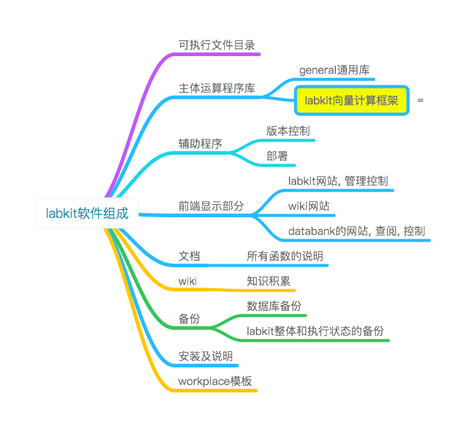
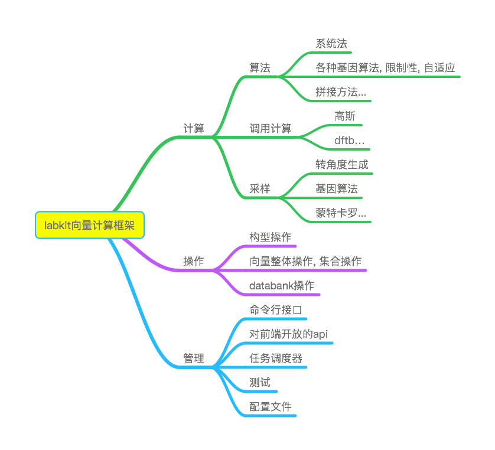
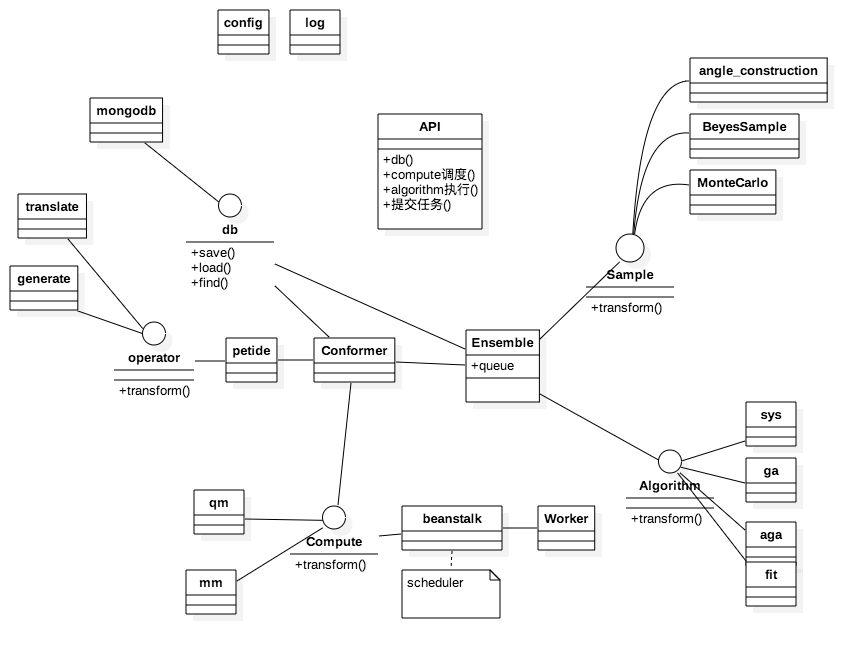
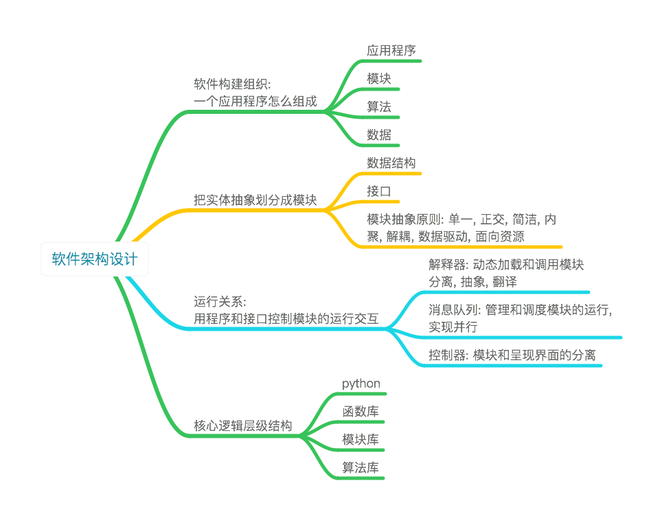

labkit\_ppt
===========

-1. 概念工作原理. 背景, 目标. .
-------------------------------

### 目标和背景

我们的目标: 实现多肽乃至蛋白质的结构的高效准确预测.

于此人们已经研究了好多年, 已经进行了大量的计算, 发展了很多方法.
可见蛋白质结构寻找, 或者更普遍的生物分子的结构寻找方法是一个发展和改进的过程.

labkit是一个算法设计, 计算, 验证, 分析的框架, 同时包括一套具体的工具包. 用来寻找和推进好的方法.


### 朴素的方法遇到的问题

蛋白质和多肽的计算, 需要:
算法的设计, 大规模演算, 验证, 数据处理和分析
目前多是遇到什么问题就写什么程序, 或者遇到新的问题就要修改程序, 程序之间标准也不统一. 重用性不好. 每个人写的程序只能自己看懂和改进, 其他人最多只能使用编译好的版本, 而且一旦情况有变, 或者出现bug, 就无能为力. 无法可持续发展.

labkit提供通用的计算框架和可供方便组合的函数库. 简化工作流程.

除了用于肽链, 也可以用于其他生物化学分子的计算.


----

### labkit解决的问题

算法设计, 计算, 合作, 知识保留

约定架构, 组件正交, 统一
标准化接口, 不轻易更改, 便于模块化编程.
规范化文档, 便于记录, 维护和后来者

最终目标: 只需要给出需求, 就可以得到结果
设计: 把设计写下来就是设计稿. 可以保存.
有了设计稿, 就可以直接进行计算.
有了计算结果, 就可以直接进行已有的分析.

----

0. 我们建立了这样的工具: labkit
-------------------------------
基于集群的生物分子的建模, 计算, 验证系统.
-----------------------------------------


----

### labkit是怎样的

labkit是一个有约定标准的python编程框架. 使用约定优于配置, 基于文件和目录的组织形式.

labkit是一系列层级分明的模块的集合, 你可以用任意方式使用它们.

labkit有一个vector向量模型计算框架, 并且是目前主要计算框架.

labkit并不限于已有的模块和框架, 可以继续添加模块和计算框架.
----

### labkit是怎样工作的

----

#### 层级化
1. 语言, 语句库
1. 语言的组合->函数, 函数库
1. 函数的组合->模块, 模块库
1. 模块的组合->算法, 算法库

语言->语句库
(语句库里的)语言的组合->函数, 函数堆积->函数库
(函数库里的)函数的组合->模块, 模块堆积->模块库
(模块库里的)模块的组合->算法, 算法堆积->算法库

----

#### 模块化
labkit是一个模块组合框架, 包含多肽算需要的功能模块和并行化框架.

每一个模块可以由很多函数或文件组成.

```
.
├── algorithm   算法
├── api					对外接口
├── cmd					命令行接口
├── compute			单体计算, 高斯等
├── config.yaml
├── conformer		构型操作
├── databank		数据仓库操作
├── ensemble		集合操作
├── labkit.conf
├── module_settings  模块默认配置
├── sample		
├── scheduler		调度器
├── tests				测试代码
```

在并行框架下有如下功能模块

```
- 构型操作
  - 构型修改
  - 构型拼接
- 采样操作  
  - 构成产生
  - 基因算法
- 计算操作
  - 高斯
  - 力场
```

----

#### vector
^ 总体原则知道了后面就好实现了, 为什么是向量, 因为要并行, 向量里面每一个元素可以被并行.

labkit的并行是向量为基础的

```
[1 2 3 4]
    ↓  x^2
[1 4 9 16]
    ↓  x<5
  [1 4]
    ↓  sum
    5
```
向量每一个元素可以分发到一个worker上执行. worker不限机器, 不限系统.


----


^ 我们知道有一些计算是必须顺序执行不能并行的, 后一步计算依赖上一步计算的结果的计算都是不能并行的.
串行的过程怎么办. 只需要写在并行之间的模块里面就行了. 或者写在只有一个元素的向量里面就行了. 向量可以转化为标量, 对不对.


1. 向量元素之间的关系必须平行
2. 不能并行的过程, 写在模块里面. 或者用只有一个元素的向量.

----

向量化之后的流程结构, 用yaml的格式描述. labkit讲根据描述进行计算.

#### Labkit软件组成
labkit的具体的软件组织结构



#### Labkit向量计算框架





#### Labkit软件架构设计和开发原则



#### labkit的使用
包括后端计算框架的使用和开发
以及前端呈现界面的使用

##### labkit后端使用: 如何用labkit计算
主要看说明文档, 用命令行的方式使用
具体参看文档教程或wiki页面

##### Labkit前端界面:如何查看和管理资源
通过网站形式呈现
[labkit网站]()
[本网站]

#### 合作开发
使用git版本控制系统合作开发程序和文档, 以及知识库.
全部都是以文本形式存在.


----

总结
----

续
--

1.0版本, 下次组会发布. 这次很多精力在wiki和思考实现合作开发上面.
最后理顺一遍代码之后下周发布1.0版本.


-----------------------
