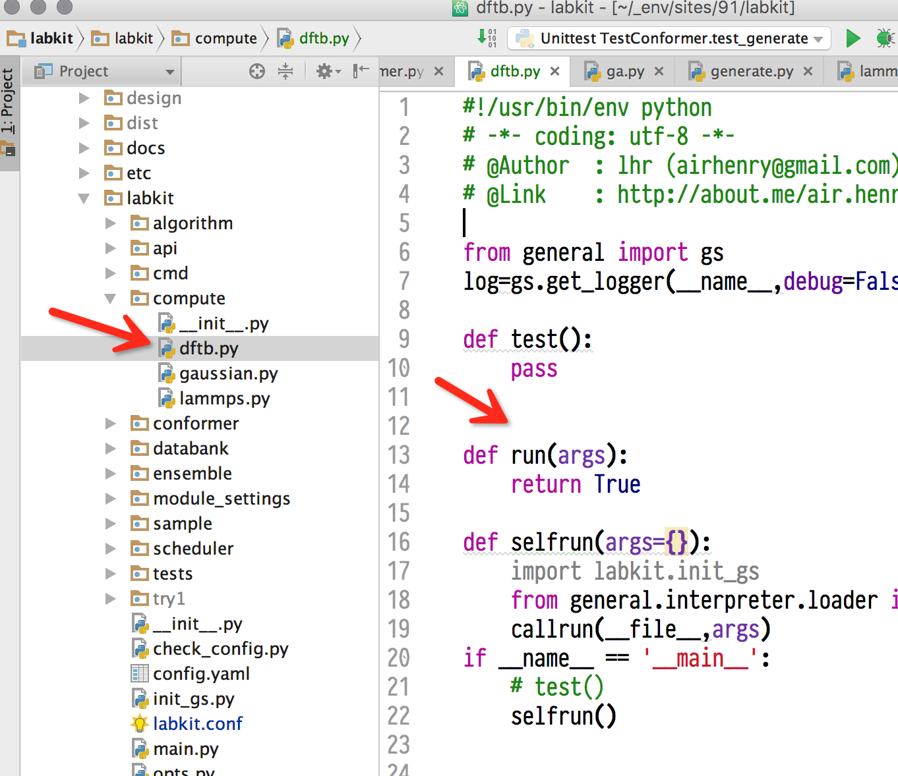
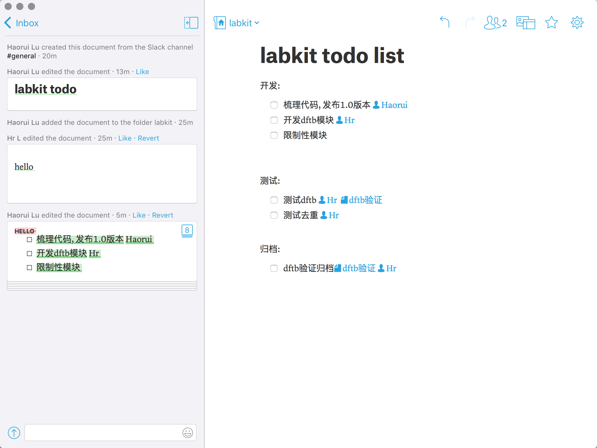

完整开发流程, 要做的步骤
-----------------------------

### 版本控制

#### git分支示意图

分支和合并的概念:

```
0-->1-->2-->3-->merge
    |          ↗
    |-->4-->5-/
```

----

#### labkit的版本控制流程
1. 下载并新建分支. `gy clone, gy dev`
2. 修改, 提交到本地分支.  `gy commit`
3. 拉取主分支最新版本, 合并到本地分支. `gy sync`
4. 推送到主分支. `gy push; pull-request`

```
master 0-->1-->2-->3-\ ------>merged  
           |          ↘     ↗           
       dev |-->4-->5-->sync-/
```

#### 整合过的过程

因为每天都要同步, git有很多命令, 这里不介绍, 合并成一个命令gy, 然后有三条子命令: 本地commit, 获取最新版本sync(并解决冲突), 提交到远程push

### 步骤
#### 抓取最新分支
```
gy clone https://github.com/lhrkkk/labkit
gy dev
```

#### 编写代码, 执行, 编写文档
编写代码, 调试执行, 测试通过, 编写文档, 然后提交到主分支.
以编写一个模块为例:



----

### 编写一个模块
在相应目录下面建立文件, 使用如下模板:

```python
#!/usr/bin/env python
# -*- coding: utf-8 -*-

from general import gs
log=gs.get_logger(__name__,debug=False)

def test():
    pass


def run(args):
    return True

def selfrun(args={}):
    import labkit.init_gs
    from general.interpreter.loader import callrun
    callrun(__file__,args)
if __name__ == '__main__':
    # test()
    selfrun()

```

调用模块的时候, 就会调用run函数. 作用于向量的每一个元素.

调试执行之后, 编写文档,

### 提交
完成修改后,
```
# 1. 提交到本地
gy commit
# 2. 拉合并最新的主分支  
gy sync
# 3. 提交到主分支, 自动发起pull-request
gy push

```
代码仓库管理员会审核提交, 并决定是否接受.


<!-- ### 编写文档

### 提交 -->

----


3. 合作和wiki
-------------

### 需要保留成果==>仓库

----

#### 代码仓库: git


----


----

#### 知识仓库: wiki, 公开wiki和私有wiki

文本化的wiki, 像普通文件一样编辑, 用git提交, 或者网页上面直接编辑.


实际上就是这样的一个文件夹:


markdown格式. 可以自行打开编辑, 同时网页上面也可以编辑.


----

#### markdown语法

markdown是一种标记语言.
例如latex里面用`\section{第一章}` 指定文字`第一章`是一个section, 这就是一种标记.

```
# 一级标题
## 二级标题
### 三级标题
- item1
- item2


这是一个链接[百度](http://www.baidu.com)

这是一个wiki词条[各种计算方法比较](), ()里面不填东西即可

```
显示如下


# 一级标题
## 二级标题
### 三级标题
- item1
- item2

这是一个链接 [百度](http://www.baidu.com)

这是一个wiki词条 [各种计算方法比较](), ()里面不填东西即可

----

----

### 流动的过程==>专门工具

需要达成同步, 交流, 任务列表的功能, 是典型需求, 使用已有的工具.

todo-list, 团队管理有很多, tower, Teambition, Worktile, Fengche.co, 瀑布IM

经过一一试用之后, 得到结论:

----

#### 任务计划和分发, 共享文档: quip
- 作用是共同编辑文档, 对应word, excel格式. 放在一个窗口里.
- 可以合作编辑任务列表.
- 可以\@人, \@文档



----


----

#### 即时通讯: slack
- 功能类似群
- 可以保留讨论记录, 可以保留传输的文档.
- 可以帖代码, 有代码高亮
- 可以分频道讨论
- 和quip融合, 聊天中可以@quip中的文档


----
